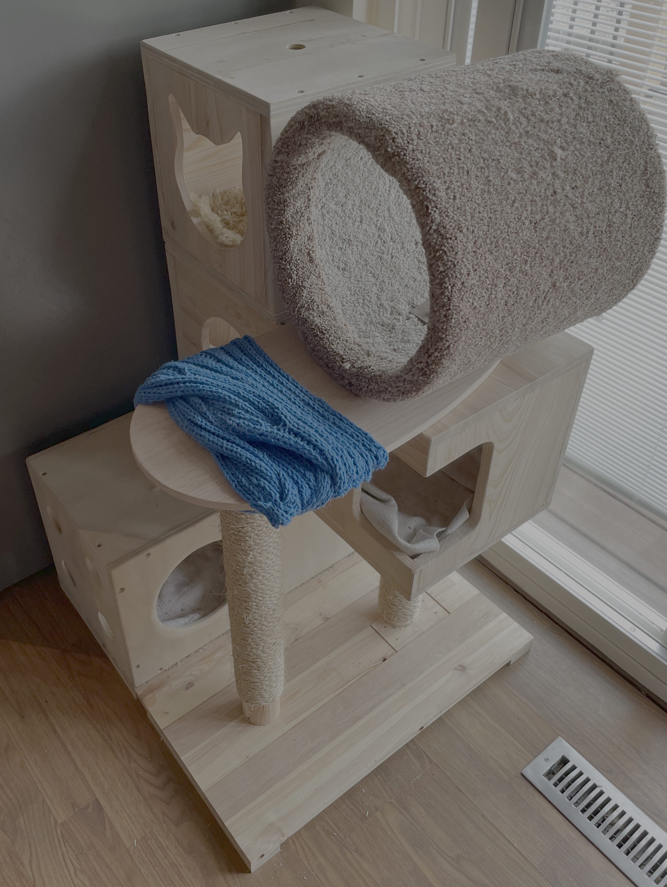
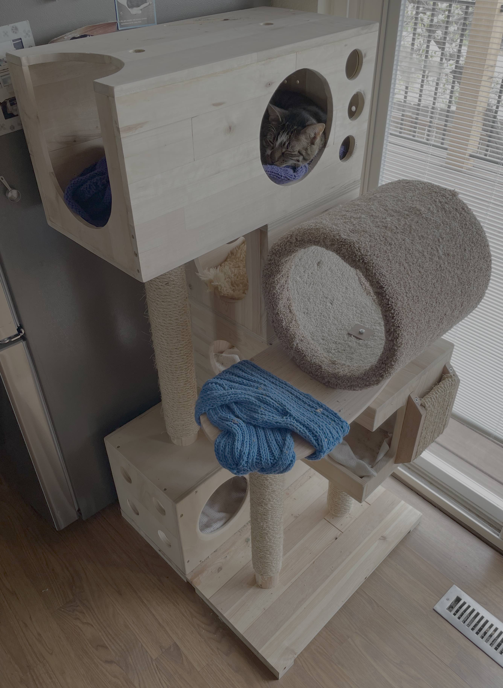
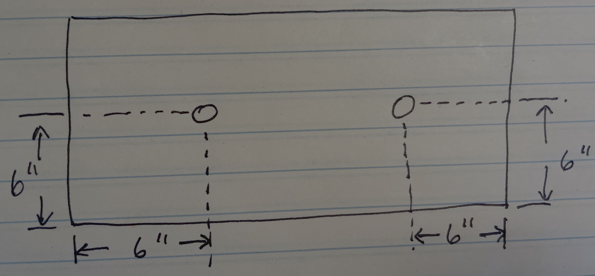
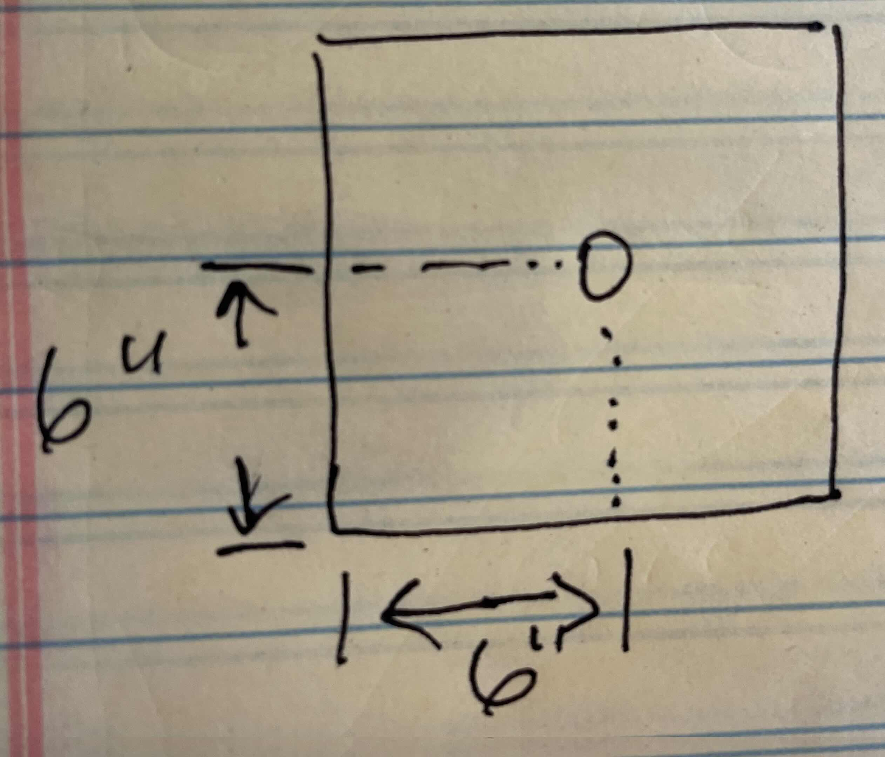
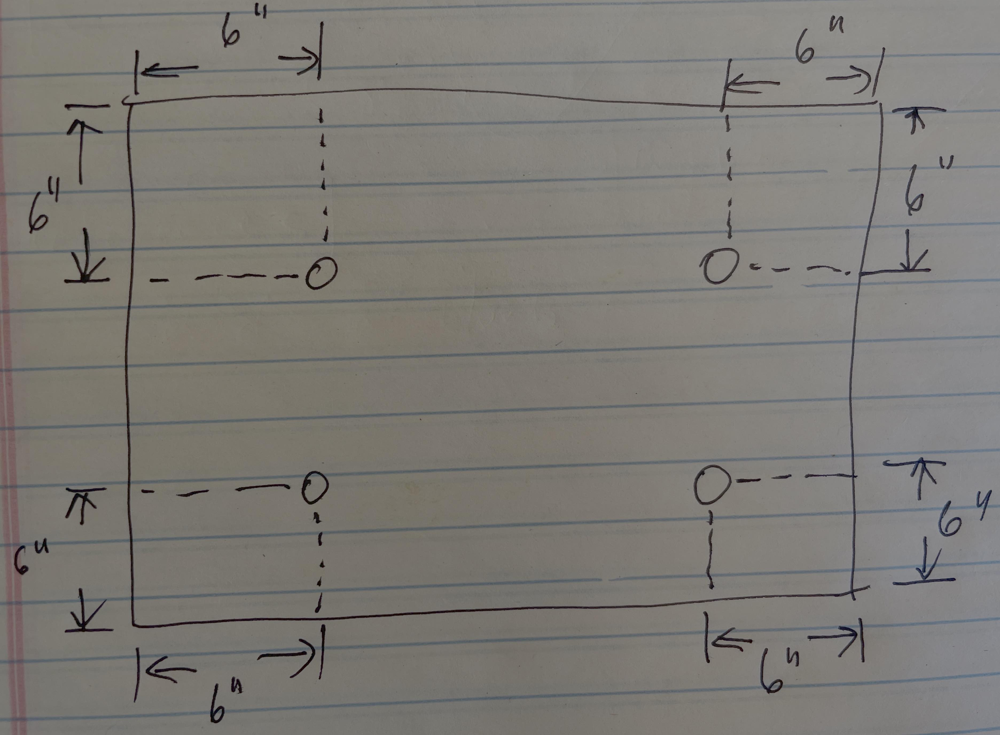
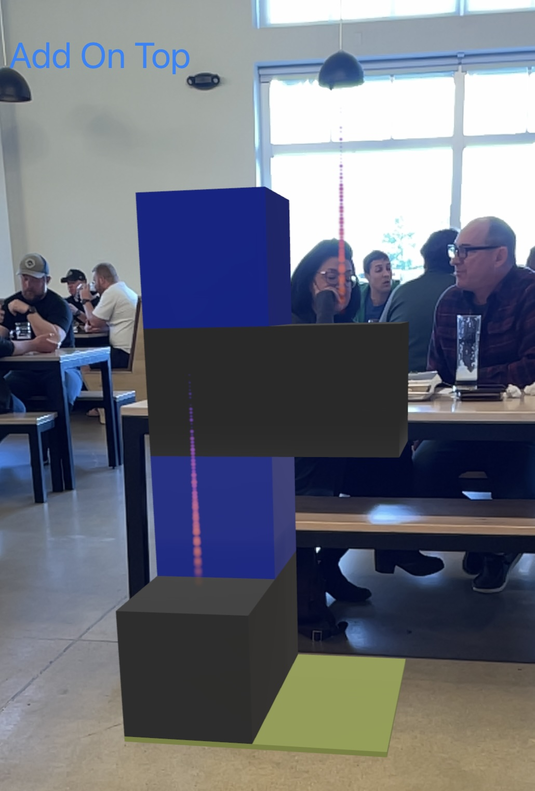

## This project has the following main goals

1. Enable cat trees to be built from relatively simple, modular components.
2. Those cat trees can be re-built, or reorganized when you see the need.
   E.g., you have additional components or want to replace a component or just want to give your cats something different.
3. Allow the components to be built at home in your shop, or by vendors. 
4. Allow new types of components to be relatively simply added. E.g., it's just up to your creativity.
5. Not have to build an entire tree to have something your cat(s) will use and like. Big projects can be overwhelming. I prefer having a useful result at each stage. e.g., a single box component can be something your cat will like.
6. Have an open plan, that you don't have to pay for.

| Example full cat trees | |
|---|---|
|  |  |

NOTE: The circular carpeted component isn't strictly speaking one of the modular components. It's just a piece from a more traditional cat tree that I bolted on. It should be no real problem, however, to make a circular carpeted component that is more standardized.

## Components

### Connections
Each component has standardized hole locations so you can bolt one component to various other components. The hole locations are given along with the components. Each hole is 1" in diameter.

### Basic components 

#### 1' x 1' x 2' box (outside dimensions)
Hole locations: There are four holes. This is the view from the top and bottom of the box.

#### 1' x 1' x 1' box (outside dimensions)
Hole locations: There are two holes. This is the view from the top and bottom of the box.

#### 1' scratching post

This is a 1' long wood dowel with a diameter of about 2.5", wrapped in sisal. I used a hot glue gun to stick the sisal to the dowel. The bolts on either end are hanger bolts, which have a regular threaded bolt on one end and a wood screw on the other end.

#### 2' scratching post

This is a 2' long wood dowel with a diameter of about 2.5", wrapped in sisal. I used a hot glue gun to stick the sisal to the dowel. The bolts on either end are hanger bolts, which have a regular threaded bolt on one end and a wood screw on the other end.

#### 2' x 2' base
Hole locations: There are four holes. This is the view from the top (or bottom).

I used approx. 3/4" thick material for the base, and attached further 3/4" legs to that to avoid the bolts scraping the floor.

## In progress work

* An iOS (iPad, iPhone) and visionOS AR (Augmented Reality app) to let you see how specific components will look in your home before you build them or build them. The Github repo for this project is private, but here's a glimpse of what a tree looks like so far:

## Further plans

* Add more detail to the above plans. They're a bit slim so far.
